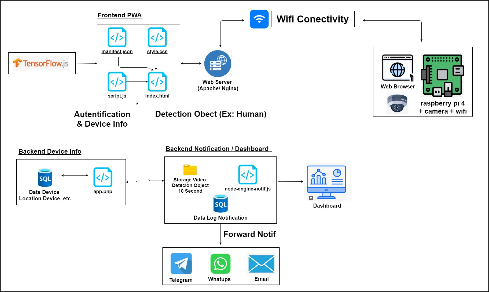

# Smart Proactive Security System: TensorFlow.js & Edge Computing using Raspberry Pi 4

This system is a **smart proactive security camera solution**. It combines low-cost **edge computing hardware** (Raspberry Pi 4) with **Web-based Artificial Intelligence (AI)** for efficient processing and highly flexible maintenance.

## Table of Contents
  - [Table of Contents](#table-of-contents)
  - [A. Core Architecture](#a-core-architecture)
    - [Key Components](#key-components)
  - [B. Key Advantages (Maintenance \& Long-Term Cost)](#b-key-advantages-maintenance--long-term-cost)
    - [C. Centralized AI Model Updates](#c-centralized-ai-model-updates)
    - [D. Frontend PWA \& Detection Flexibility](#d-frontend-pwa--detection-flexibility)
    - [E. Proactive Notifications and Digital Evidence](#e-proactive-notifications-and-digital-evidence)
  - [F. Key Technology Stack](#f-key-technology-stack)
  - [G. Source Code](#g-source-code)
  - [F. Sample](#f-sample)

## A. Core Architecture
dsadas

The architecture uses a **Raspberry Pi 4 + Camera** as the **edge device** for video capture. The main intelligence is in the application layer, specifically the **Frontend PWA (Progressive Web Application)**, which runs the object detection (e.g., *Human*).

### Key Components

| Component | Key Role |
| :--- | :--- |
| **1. Edge Device** | Raspberry Pi 4 + Camera + WiFi (Video Acquisition) |
| **2. AI Engine** | Frontend PWA (TensorFlow.js) - *Client-Side* Object Detection |
| **3. Server** | Web Server (Apache/Nginx) - Hosts the PWA & AI Model |
| **4. Backend** | Backend Notification/Dashboard (Stores Logs & Handles Notifications) |

## B. Key Advantages (Maintenance & Long-Term Cost)

This approach is designed for **highly centralized and efficient maintenance**, making it a low-cost solution for the long term.

### C. Centralized AI Model Updates

* **TensorFlow.js (TF.js) on the Client (PWA):** The main benefit is using **TensorFlow.js** on the client (PWA) to load the AI model (e.g., COCO-SSD) from the server.
* **Minimal Deployment:** **AI Model updates** (like adding new objects to detect) are **done in only one place**—the **Web Server**.
* **No Physical Device Deployment Needed:** This approach **removes the need to physically deploy new firmware or applications to every Raspberry Pi** each time the model is updated or improved.

### D. Frontend PWA & Detection Flexibility

The Frontend PWA (`manifest.json`, `style.css`, `script.js`, `index.html`) acts as the detection control center, using a JavaScript base for high flexibility. **Our main focus is on the PWA for object detection.**

* **Centralized Detection Collection Maintenance:** Changes or additions to the object detection list are made only by updating the PWA logic or the model on the server.
* **Custom Camera Settings:** The system supports **custom services** where detection parameters, *confidence scores*, and camera configurations can be **different for each Raspberry Pi**, controlled via the *service server*.
* **Dynamic Technology:** Using **TensorFlow.js** based on JavaScript provides **great value in flexible and dynamic maintenance**.

### E. Proactive Notifications and Digital Evidence

This system functions as a **proactive security camera** with a multi-channel notification mechanism:

* **Brief Evidence Recording:** Detection results are sent to the **Backend Notification/Dashboard** (`node-engine-notif.js`), which saves **10-second video clips** of the event, optimized for small size (just a few megabytes).
* **Multi-Channel Notification Forwarding:** All important detections are automatically forwarded in *real-time* to **Telegram, WhatsApp, and Email**, and shown on the **Dashboard** for centralized monitoring.

## F. Key Technology Stack

* **AI/ML:** TensorFlow.js (TF.js)
* **Frontend:** Progressive Web Application (PWA) - HTML, CSS, JavaScript
* **Edge Hardware:** Raspberry Pi 4 + Camera
* **Server:** Apache / Nginx, App.php (Backend Device Info), node-engine-notif.js (Backend Notification)
* **Database:** SQL (Device Info Data & Notification Log Data)

## G. Source Code

Source code for exploration is available at:

[https://github.com/dendie-sanjaya/ai-object-detection](https://github.com/dendie-sanjaya/ai-object-detection)

## F. Sample

This Example detection object human 

This Example detection object human (video)

**Video:** : 
